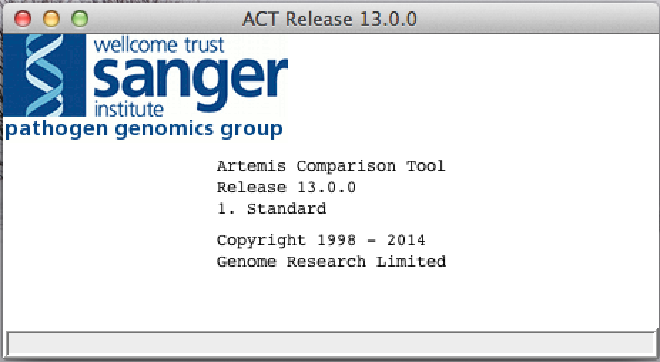
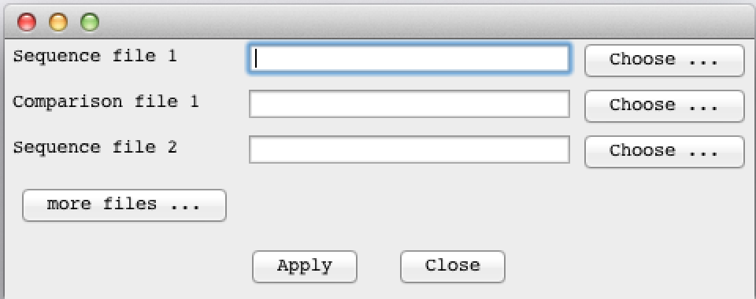
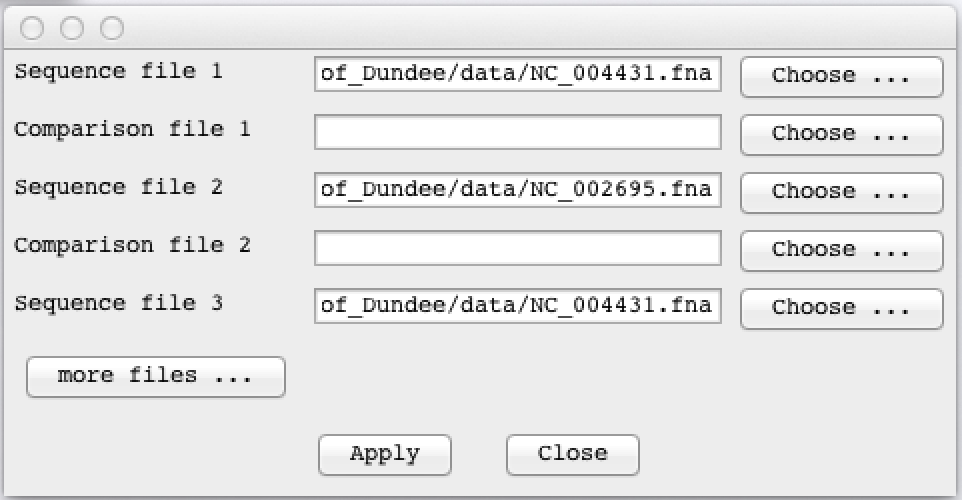
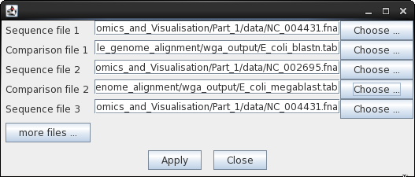
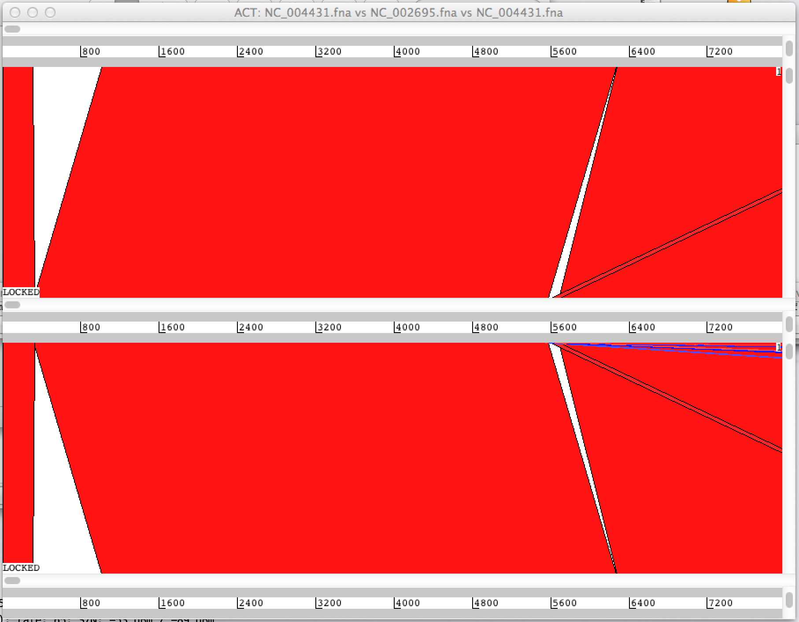
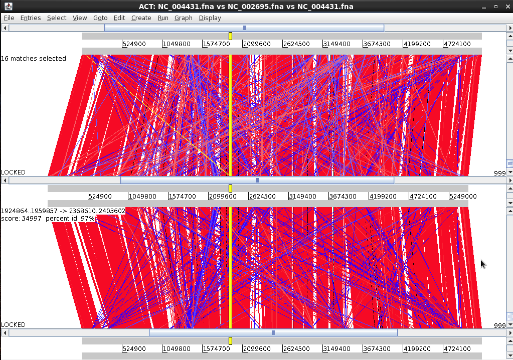
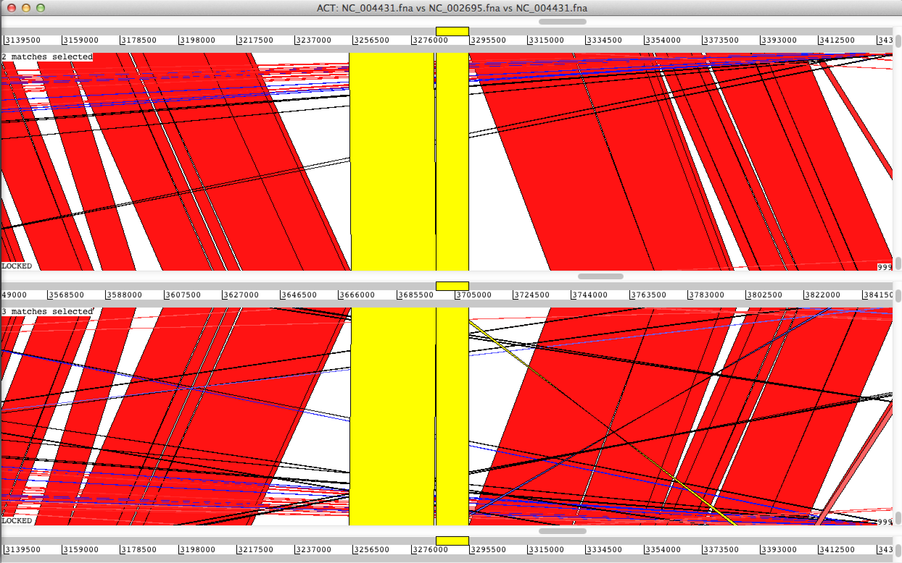
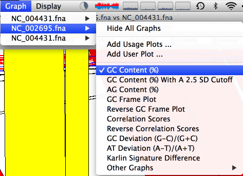

# Artemis Comparison Tool (ACT)

## Installation 

### Installing Java
The current Java 11 version can always be obtained from https://jdk.java.net/archive/. 

```sh
$ tar xvf openjdk-11*_bin.tar.gz
#or
$ unzip openjdk-11*_bin.zip

$ sudo apt update

$ sudo apt install default-jdk

$ java -version

$ export JAVA_HOME=”/Library/Java/JavaVirtualMachines/jdk-11.0.1.jdk/Contents/Home”

$ export PATH="$JAVA_HOME/bin:$PATH"
```
---


### Sequence and Annotation File Formats

•     EMBL format.
 
•     GenBank format.
 
•     GFF3 format. 
 
•     FASTA nucleotide sequence files can be one of the following:
 
•      Single FASTA sequence.
 
•      Multiple FASTA sequence. 
 
•      Indexed FASTA files can be read in. The files are indexed using SAMtools:

```
samtools faidx ref.fasta
```

•     Indexed GFF3 format. This can be read in and overlaid onto an indexed FASTA file. The indexed GFF3 file contains the feature annotations. To index the GFF first sort and bgzip the file and then use tabix with "-p gff" option (see the tabix manual):
 ```
(grep ^"#" in.gff; grep -v ^"#" in.gff | sort -k1,1 -k4,4n) | bgzip >
sorted.gff.gz;
 ```
 ```
tabix -p gff sorted.gff.gz
 ```
 ---
# Tutorial
<br>

### 软件界面:
 </a>

### 输入文件基因组序列
 </a>
 </a>
 </a>

### 输入比对文件
 </a>
<hr>

### 浏览比对结果
 </a>
 </a>
 </a>
 </a>

### 同时可以查看序列信息，如：GC 
 </a>