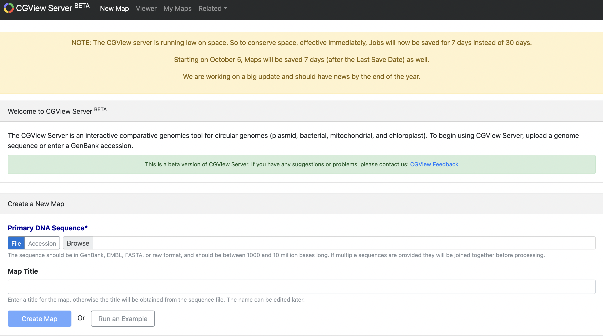

# GCView

## 网页版：

http://cgview.ca

打开网页并提交基因组.fasta序列


## 本地版：
### 使用过程：：
1   文件准备以及格式：

1）  基因组文件：为细菌的基因组序列（fasta格式，或者gbk格式）

2）  标记基因文件：表头必须为以下8列（红色列必须给出，其他列的值可空或者用‘.’代替）
 
|seqname |source|feature|start|end|score|strand|frame|
---
<table>
        <tr>
            <th>seqname</th>
            <th>feature</th>
            <th>start</th>
            <th>end</th>
            <th>strand</th>
        </tr>
        <tr>
            <th>基因名字</th>
            <th>基因类别</th>
            <th>起始位置</th>
            <th>终止位置</th>
            <th>正负连</th>
        </tr>
        </tr>
    </table>

3）  blast结果文件（输出m8即可）

这些列必须得有数据：
query_id

%_identity

q_start

q_end

alignment_length

evalue


#### 生成XML文件：
```sh
perl /share/work/biosoft/CGView/cgview/cgview_xml_builder/cgview_xml_builder.pl -sequence demo.fa -output contigs.fa.xml -tick_density 0.7  -linear T -size  large  -gene_decoration arc -genes annotion1.pos connect_seq.pos -blast gene.blast -hit_labels T
```

```sh
java -jar -Xmx1500m /share/work/biosoft/CGView/cgview/cgview.jar -i contigs.fa.xml -o map.png -f png
```

